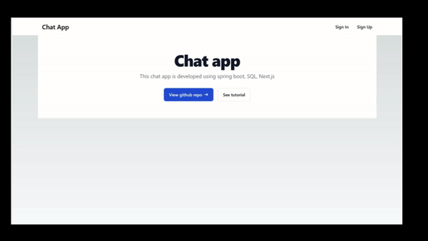
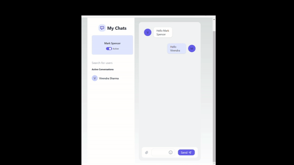

# chat-service
A full stack web application using Spring Boot, JWT, React.js, Next.js, and mariaDB. This repository showcases modern development practices, offering secure authentication, dynamic user interfaces, and efficient data management.

## Login and registration


## Chats


## Requirements

1. Java - 11+

2. Gradle - 8.x.x

3. MariaDB - 11.3.0-MariaDB

4. Node - 18.x.x


## Steps to Set up backend

**1. Clone the application**

```bash
git clone https://github.com/virendrasharma1/spring-boot-next-mysql-websocket-jwt-chat-app.git
```

**2. Create mariaDB database**
```bash
create database chat_service
```

**3. Change mariaDB username and password as per your installation**

+ open `src/main/resources/application.properties`

+ change `spring.datasource.username` and `spring.datasource.password` as per your mysql installation

**4. Build and run the app using gradle**

```bash
cd chat-backend
./gradlew build
./gradlew bootRun
```
The backend server will start at <http://localhost:9090>.
## Steps to Set up frontend

**5. Frontend**
```bash
cd chat-frontend
npm run dev
```

The frontend will start running at <http://localhost:3000>.
